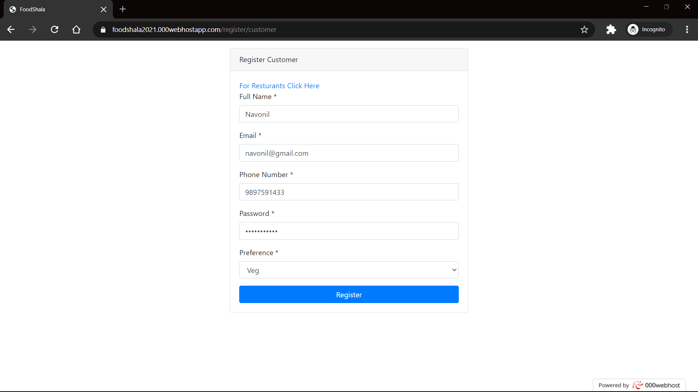

# FoodShala

For visiting app online [Click Here](https://foodshala2021.000webhostapp.com/).

## Deployment

Create Database with any name.

1. Create a copy of 'application/config/database_copy.php' to 'application/config/database.php'.

2. Edit the 'database.php' according to your need.[For more Info](https://codeigniter.com/userguide3/database/configuration.html)

3. After the change, Edit the 'application/config/config.php' change `$config['base_url']` to the base url for your website.

4. Create Required tables & Default rows by using following command ```mysql -u username -p -D database_name < initial.sql```

5. After all the changes copy the current directory to your webserver directory.

   1. For XAMPP windows directory is `<xampp install directory>/htdocs`

   2. For LAMP Linux directory is `/var/www/html` command is ```cp -r ./ /var/www/html/```

6. Start the server and visit local url.

## Screenshots

### Customer

Home Page Without login


Login


Sign Up


Customer Home (Veg)


Cart


My Orders


### Restaurant

Restaurant Home.


Customers Orders.


Completed Orders.


Add Food Item.


Update Food Item.


All Food Items.

